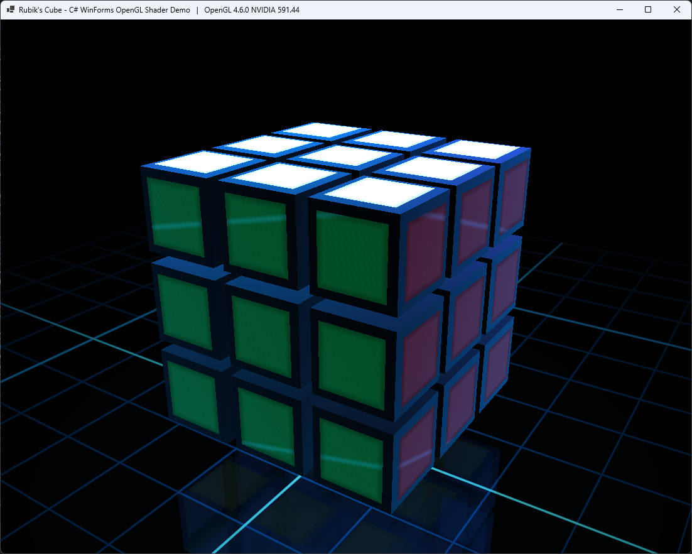

# Rubik’s Cube C# and OpenGL implementation



A small single-file C# graphics demo that renders an interactive Rubik's Cube with modern OpenGL 4 shaders.

The goal of this project is not to use an engine or a ready-made 3D framework, but to keep the rendering pipeline visible: WinForms for the window and input handling, raw OpenGL loaded through P/Invoke, GLSL shaders, custom mesh generation, camera control, animation, and a few visual effects implemented directly in code.

## Features

- Interactive 3D Rubik's Cube
- Mouse-controlled camera rotation
- Mouse wheel zoom
- Keyboard-controlled face rotations
- Smooth animated 90-degree turns
- Scramble and reset support
- Colored cube stickers
- Glossy black plastic body
- OpenGL 4 shader pipeline
- GLSL vertex and fragment shaders
- VBO/VAO-based rendering
- Procedural glowing grid floor
- Simple mirrored floor reflection
- Fresnel-style reflections
- Rim lighting
- Animated scan highlight effect
- No third-party libraries
- One C# source file

## Tech stack

- C#
- .NET / WinForms
- OpenGL 4
- GLSL
- P/Invoke
- Windows API / WGL

## Controls

| Input | Action |
|---|---|
| Left mouse drag | Rotate camera |
| Mouse wheel | Zoom in / out |
| `U` | Rotate upper face |
| `D` | Rotate bottom face |
| `L` | Rotate left face |
| `R` | Rotate right face |
| `F` | Rotate front face |
| `B` | Rotate back face |
| `Shift + U/D/L/R/F/B` | Rotate the selected face in the opposite direction |
| `S` | Scramble cube |
| `Ctrl + R` | Reset cube |
| `Home` | Reset camera |
| `Esc` | Close application |

## Running the project

Create a new WinForms project and replace the generated `Program.cs` with the single-file source code from this repository.

```powershell
dotnet new winforms -n RubiksGL4
copy RubiksOpenGL4ShadersOneFile_fixed2.cs RubiksGL4\Program.cs
dotnet run --project RubiksGL4
```

Alternatively, rename the source file to `Program.cs` inside an existing WinForms project.

## Requirements

- Windows
- .NET SDK
- GPU and driver with OpenGL 4 support

The project uses WGL and `opengl32.dll`, so it is Windows-specific.

## Implementation notes

The application creates an OpenGL context manually from a WinForms window handle and loads required OpenGL functions through `wglGetProcAddress`. Rendering is done with vertex buffers, vertex array objects, and GLSL shaders.

The cube itself is generated procedurally. Each small cubie has a black body and separate colored sticker geometry. Face turns are animated by temporarily applying an additional transform to the cubies that belong to the active layer, then committing their logical positions and sticker orientations after the animation finishes.

The visual style is intentionally more like a small graphics demo than a basic puzzle implementation: the scene includes a dark background, blue rim lighting, glossy highlights, procedural reflections, a glowing floor grid, and a mirrored reflection pass under the cube.

## Why this project exists

I wanted to combine a classic interactive puzzle with a more modern rendering approach while keeping the whole program compact and transparent. No engine, no helper libraries, no hidden rendering framework — just C#, WinForms, OpenGL, GLSL, and the required Windows interop code in one place.

## Support

If you found this project interesting or useful, you can support my work:

[](https://github.com/sponsors/makarov-mm)